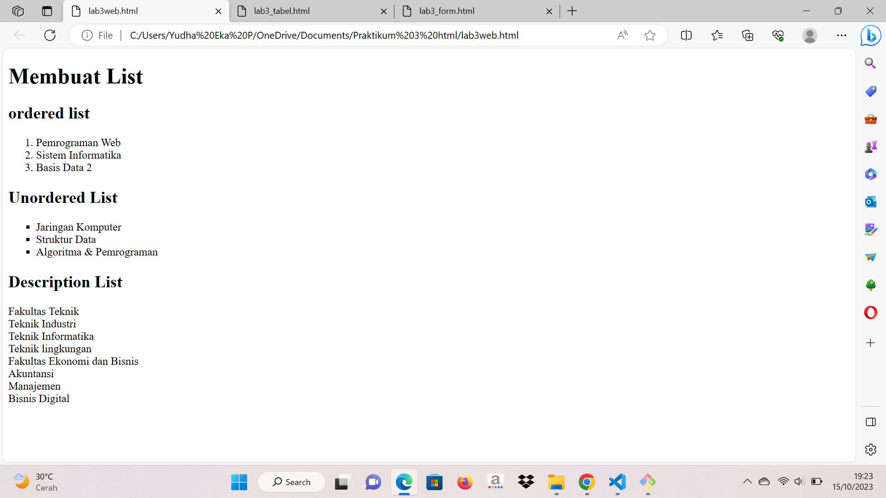

# Praktikum3
~~/n

#Praktikum 3: Membuat List, Table dan Form

#Contoh Gambar

#Contoh Table

.png)

#Contoh Form

.png)
~~~

~~/n
#Membuat List (Code)

<!DOCTYPE html>
<html lang="en">
<head>
    <meta charset="UTF-8">
    <meta name="viewport" content="width=devide-width, initial-scale=1.0">
</head>
<body>
    <header>
        <h1>Membuat List</h1>
    </header>
</body>
</html>
<section id="order-list">
    <h2> ordered list</h2>
    <ol>
        <li>Pemrograman Web</li>
        <li>Sistem Informatika</li>
        <li>Basis Data 2</li>
    </ol>
</section>

<section id="unorder-list">
    <h2>Unordered List</h2>
    <ul type="square">
        <li>Jaringan Komputer</li>
        <li>Struktur Data</li>
        <li>Algoritma & Pemrograman</li>
    </ul>
</section>

<section id="unorder-list">
    <h2>Description List</h2>
    <dl>
        <dt>Fakultas Teknik</dt>
        <dt>Teknik Industri</dt>
        <dt>Teknik Informatika</dt>
        <dt>Teknik lingkungan</dt>
        <dt>Fakultas Ekonomi dan Bisnis</dt>
        <dt>Akuntansi</dt>
        <dt>Manajemen</dt>
        <dt>Bisnis Digital</dt>
    </dl>
</section>

#Membuat Table (code)

<!DOCTYPE html>
<html lang="en">
    <head>
        <meta charset="UTF-8">
        <meta name="viewport" content="width=devide-width," initial-scale="1.0">
    </head>
<body>
    <header>
        <h1>Membuat Table</h1>
    </header>
</body>
</html>
<table border="1" cellpadding="4" cellspacing="0">
    <thead>
        <tr>
            <th>No.</th>
            <th>Fakultas</th>
            <th>Program Studi</th>
        </tr>
    </thead>
    <tbody>
        <tr>
            <td>1.</td>
            <td>Teknik</td>
            <td>Teknik Informatika</td>
        </tr>
        <tr>
            <td>2.</td>
            <td>Teknik</td>
            <td>Teknik Industri</td>
        </tr>
        <tr>
            <td>3.</td>
            <td>Teknik</td>
            <td>Teknik lingkungan</td>
        </tr>
    </tbody>
</table>

<table border="1" cellpadding="6" cellspacing="0">
    <thead>
        <tr>
            <th>No.</th>
            <th>Fakultas</th>
            <th>Program Studi</th>
        </tr>
    </thead>
    <tbody>
        <tr>
            <td>1.</td>
            <td rowspan="3">Teknik</td>
            <td>Teknik Informatika</td>
        </tr>
        <tr>
            <td>2.</td>
            <td>Teknik Industri</td>
        </tr>
        <tr>
            <td>3.</td>
            <td>Teknik lingkungan</td>
        </tr>
    </tbody>
</table>

#Mebuat Form

<!DOCTYPE html>
<html lang="en">
<head>
    <meta charset="UTF-8">
    <meta name="viewport" content="width=devide-width," initial-scale="1.0">

</head>
<body>
    <header>
        <h1>Membuat form</h1>
    </header>
</body>
</html>

<form action="proses.php" method="post">
    <fieldset>
        <legend>Data Pelanggan</legend>
        

            <label for="nama">Nama</label>
            <input type="text" id="nama" name="nama">
        

        

            <label for="alamat">Alamat</label>
            <textarea id="alamat" name="alamat" cols="20" rows="3"></textarea>
        

        

            <label>Jenis Kelamin</label>
            <input id="jk_1" type="radio" name="Kelamin" value="L" /><label
for="jk_1">Laki-laki</label>
           <input id="jk_p" type="radio" name="Kelamin" value="P" /><label
for="jk_p">Perempuan</label>
        

        
<input type="submit" value="Login">

    </fieldset>
</form>

~~~